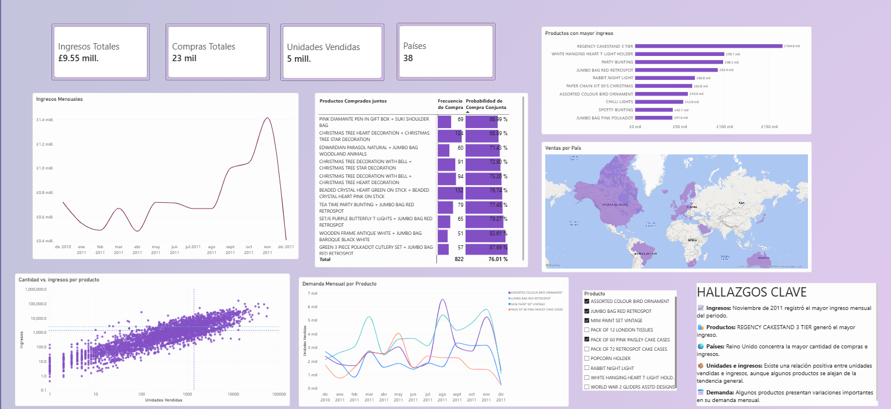

<div align="center">

# 📊 Análisis de Ventas

### Online Retail Dataset

Análisis de datos transaccionales para identificar patrones de ventas y oportunidades comerciales.

<br>


</div>

---

## 🎯 Sobre el proyecto

Este proyecto analiza datos transaccionales de una empresa de comercio minorista utilizando Python y herramientas de análisis y visualización de datos.

El análisis parte del dataset original **Online Retail** y sigue un flujo de trabajo que incluye exploración de los datos, limpieza y transformación mediante un script independiente, análisis de diferentes preguntas de negocio y visualización de resultados.

El proyecto busca comprender el comportamiento de las ventas desde distintas perspectivas, incluyendo los productos, los ingresos, los mercados y la demanda, con el propósito de transformar los datos transaccionales en información útil para apoyar decisiones comerciales.
## 🔎 Preguntas de negocio

El análisis busca responder las siguientes preguntas:

| # | Pregunta |
|:---:|---|
| **01** | ¿Qué productos suelen comprarse conjuntamente? |
| **02** | ¿Cuáles son los meses con mayor generación de ingresos? |
| **03** | ¿Qué productos generan mayores ingresos? |
| **04** | ¿Qué productos tienen alta rotación pero un bajo aporte a los ingresos? |
| **05** | ¿Los países con más compras son necesariamente los que generan más ingresos? |
| **06** | ¿Existen patrones estacionales en la demanda de determinados productos? |


## 📊 Dataset

El proyecto utiliza el dataset **Online Retail**, un conjunto de datos transaccionales de una empresa de comercio minorista.

**Dataset:** Online Retail  
**Fuente:** [UCI Machine Learning Repository](https://archive.ics.uci.edu/dataset/352/online%2Bretail)  
**Registros originales:** 541,909

El dataset original contiene 8 variables relacionadas con las transacciones, incluyendo información sobre facturas, productos, cantidades, fechas, precios, clientes y países.


## 🔄 Proceso de datos

El proyecto sigue un flujo de trabajo dividido en diferentes etapas, desde la exploración inicial de los datos hasta la visualización de los resultados.

```text
OnlineRetail.xlsx
       ↓
01_exploracion_datos.ipynb
       ↓
Identificación de problemas y criterios de limpieza
       ↓
clean_data.py
       ↓
data_clean.csv
       ↓
analisis_ventas.ipynb
       ↓
Power Bi

```


## 📈 Análisis realizado

A partir del dataset procesado se desarrollaron seis análisis orientados a responder preguntas de negocio:

### 🛒 Asociación entre productos

Se analizaron los productos que aparecen conjuntamente en una misma factura para identificar relaciones de compra y posibles oportunidades de venta cruzada.

### 💰 Ingresos por período

Se calcularon los ingresos mensuales para identificar los períodos con mayor generación de ingresos dentro del conjunto de datos.

### 📦 Productos con mayores ingresos

Se calcularon los ingresos acumulados por producto para identificar los artículos con mayor aporte a los ingresos por ventas.

### 🔄 Rotación y aporte a los ingresos

Se comparó la cantidad de unidades vendidas con los ingresos generados para identificar productos con alta rotación y bajo aporte relativo a los ingresos.

### 🌎 Compras e ingresos por país

Se comparó el número de compras con los ingresos generados por país para analizar las diferencias entre volumen de compras y generación de ingresos.

### 📅 Comportamiento de la demanda

Se analizó la evolución mensual de las unidades vendidas de determinados productos para identificar variaciones en la demanda durante el período disponible.


## 📌 Resultados destacados

- 💰 **Ingresos:** noviembre de 2011 registró el mayor nivel de ingresos del período analizado.
- 🛍️ **Productos:** REGENCY CAKESTAND 3 TIER fue el producto con mayor generación de ingresos.
- 🔄 **Rotación:** se identificaron productos con un elevado número de unidades vendidas pero con un aporte relativamente bajo a los ingresos.
- 🌎 **Mercados:** el volumen de compras y la generación de ingresos no presentan una relación proporcional en todos los países.
- 📅 **Demanda:** algunos productos presentan variaciones importantes en sus unidades vendidas a lo largo de los meses.

## 📊 Dashboard

El análisis se complementa con un dashboard interactivo desarrollado en **Power BI**, diseñado para presentar los principales indicadores y resultados del proyecto de forma visual.





## 📁 Estructura del proyecto

```text
PROYECTO ANALISIS DE VENTAS
│
├── backup/
├── dashboard/
├── data/
│   ├── raw/
│   └── processed/
├── notebooks/
│   ├── 01_exploracion_datos.ipynb
│   └── analisis_ventas.ipynb
├── scripts/
│   └── clean_data.py
├── .gitignore
└── README.md

```
## ▶️ Reproducibilidad

Para reproducir el análisis:

1. Descargar el dataset **Online Retail** desde su fuente original y colocarlo localmente en `data/raw/`.
2. Ejecutar el script `scripts/clean_data.py` para generar el dataset procesado en `data/processed/`.
3. Abrir `notebooks/analisis_ventas.ipynb`.
4. Ejecutar las celdas del notebook para reproducir el análisis.

Los archivos del dataset no se incluyen en el repositorio debido a su tamaño. El código y la estructura del proyecto permiten reproducir el proceso de limpieza y análisis a partir del dataset original.

## 🎯 Conclusiones generales

El análisis permitió obtener una visión más completa del comportamiento de las ventas, identificando diferencias relevantes entre productos, períodos y mercados. Analizar estas diferencias permite comprender mejor dónde se generan los ingresos y detectar oportunidades comerciales.

Esta información puede utilizarse para apoyar decisiones sobre inventario, planificación de ventas y estrategias comerciales, aprovechando los patrones identificados en los productos, las compras y los distintos mercados.

## 👩‍💻 Autor

**Klaudhet Rodríguez**

Proyecto desarrollado como parte de mi portafolio de análisis de datos.